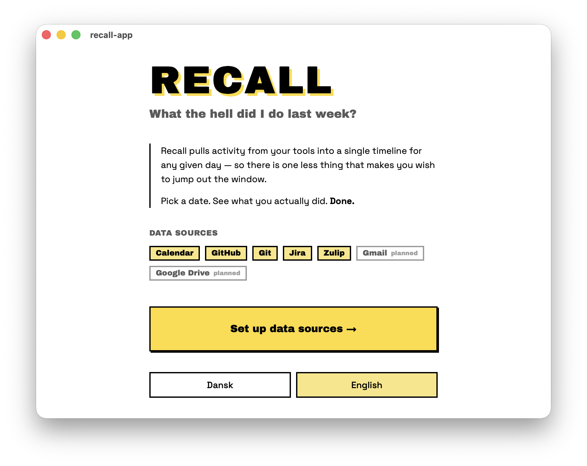
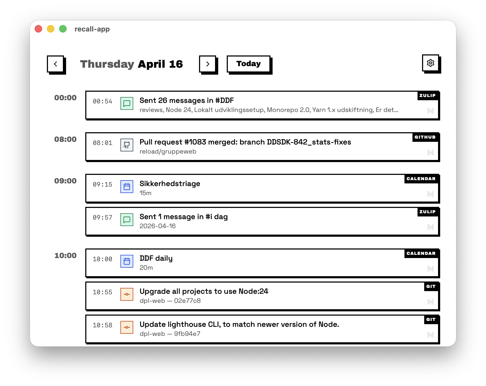
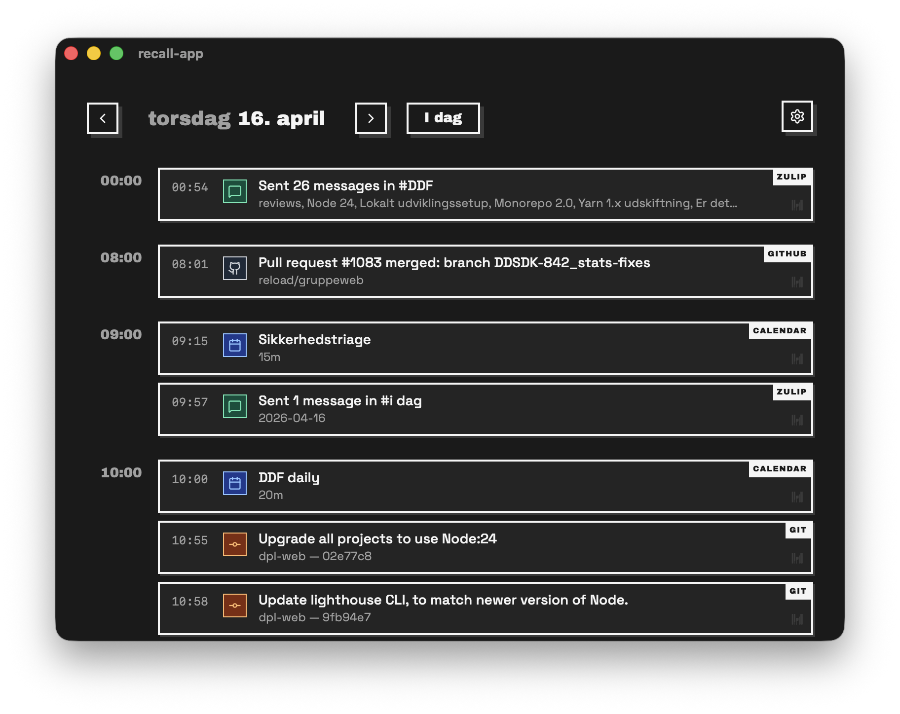

# Recall

A desktop app that builds a timeline of your prior workdays so you can fill in Harvest losing your mind.

Pick a date, and Recall pulls your activity from multiple sources into one view:

- **Calendar (`iCal`)** — meetings and events
- **GitHub** — PRs, commits, reviews, issue comments
- **Local git repos** — commits by your author name
- **JIRA** — tickets you interacted with
- **Zulip** — messages you sent

<div style="display: flex;">
  <div></div>
  <div></div>
  <div></div>
</div>

## Development

This app has built almost entirely with AI.
First with `cursor`, then with `Claude Code`.

I have also experimented with AI-design for the logo. See the process in [design/logo/preview](design/logo/preview/index.html)

```
nvm use
npm install
npm run tauri dev
```

### Tech-Stack:

- Svelte 5 + SvelteKit 2
- Tauri 2
- Rust backend
- SQLite for settings/credentials.

## To-Do's

- Gmail data-source (requires Google OAuth — see AGENTS.md for why this is deferred)
  - Sent emails
  - Read emails
- Google Drive (requires Google OAuth)
  - Edited/Created files
  - Read files
- Zulip - expanded data
  - Messages you've read
- Privacy/Ease-of-mind
  - Add a screen, that shows the last 50 commands that has been run
    - E.g., the terminal commands that has been run by git data sources, or the APIs called by Jira datasources
- Fun
  - Add more transitions and animations
  - Add a TUI
    - Either a real TUI, or a fake one, making the app easily navigated with keyboard
