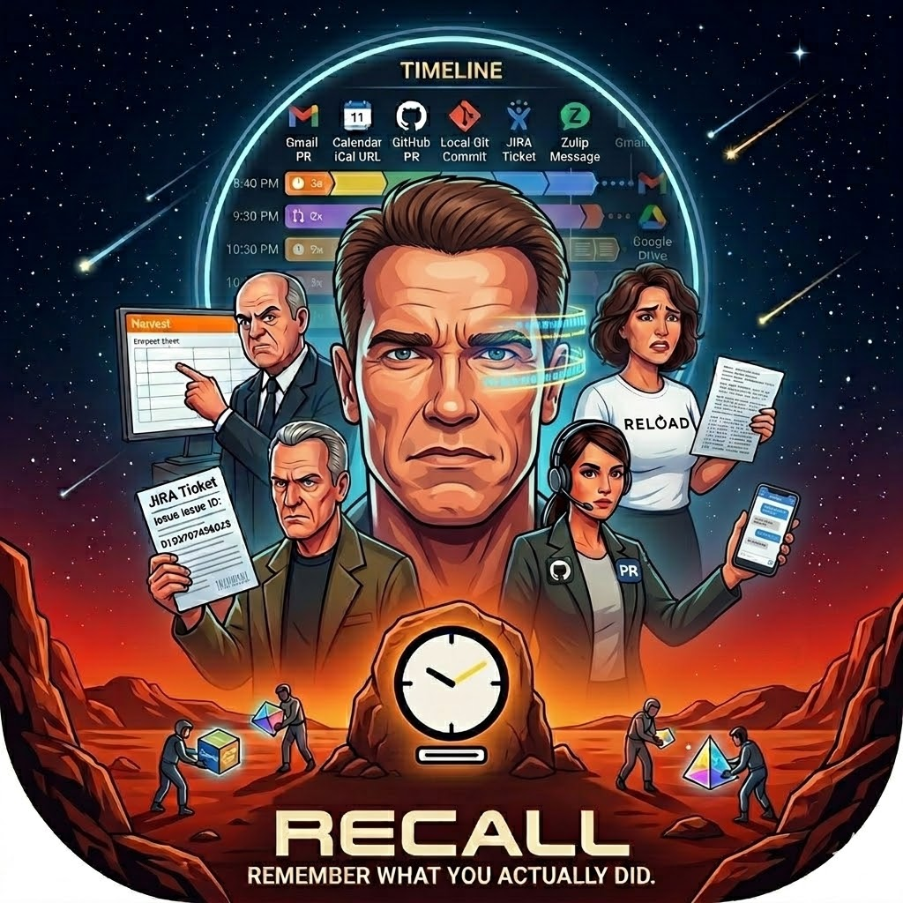
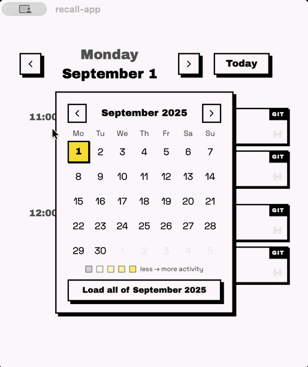

<center>
  <table width="100%">
    <tr>
      <td align="top">
        <h1>Recall</h1>
        A desktop app that builds a timeline of your prior workdays so you can fill in Harvest losing your mind.
        
        Pick a date, and Recall pulls your activity from multiple sources into one view:
        
        - **Calendar (`iCal`)** — meetings and events
          - **GitHub** — PRs, commits, reviews, issue comments
          - **Local git repos** — commits by your author name
          - **JIRA** — tickets you interacted with
          - **Zulip** — messages you sent
        
      </td>
      <td align="top">
        
      </td>
    </tr>
  </table>
  
  <table>
    <tr>
      <td width="36%"></td>
      <td width="36%"></td>
      <td width="30%"></td>
    </tr>
  </table>
</center>

## Install

| Platform | Link |
|----------|------|
| macOS (Apple Silicon) | [Recall-macOS-AppleSilicon.dmg](https://github.com/rasben/recall-app/releases/latest/download/Recall-macOS-AppleSilicon.dmg) |
| macOS (Intel) | [Recall-macOS-Intel.dmg](https://github.com/rasben/recall-app/releases/latest/download/Recall-macOS-Intel.dmg) |
| Windows | [Recall-Windows.exe](https://github.com/rasben/recall-app/releases/latest/download/Recall-Windows.exe) · [Recall-Windows.msi](https://github.com/rasben/recall-app/releases/latest/download/Recall-Windows.msi) |
| Linux | [Recall-Linux.AppImage](https://github.com/rasben/recall-app/releases/latest/download/Recall-Linux.AppImage) · [Recall-Linux.deb](https://github.com/rasben/recall-app/releases/latest/download/Recall-Linux.deb) · [Recall-Linux.rpm](https://github.com/rasben/recall-app/releases/latest/download/Recall-Linux.rpm) |

> **macOS:** If the app is unsigned, right-click → Open on first launch to bypass Gatekeeper.

## Development

This app has built almost entirely with AI.
First with `cursor`, then with `Claude Code`.

I have also experimented with AI-design for the logo.
[See the process here](https://rasben.github.io/recall-app/design/logo/preview/)

```
nvm use
npm install
npm run tauri dev
```

### Tech-Stack

- Svelte 5 + SvelteKit 2
- Tauri 2
- Rust backend
- SQLite for settings/credentials.

## To-Do's

- Performance
  - Make data-fetching happen async
  - Investigate why Zulip takes so long
- Bug: Using `local git` source on Windows opens a bunch of terminal windows.
  - Makes it look like a virus.
- Gmail data-source (requires Google OAuth — see AGENTS.md for why this is deferred)
  - Sent emails
  - Read emails
- Google Drive (requires Google OAuth)
  - Edited/Created files
  - Read files
- Zulip - expanded data
  - Messages you've read
- Privacy/Ease-of-mind
  - Add a screen, that shows the last 50 commands that has been run
    - E.g., the terminal commands that has been run by git data sources, or the APIs called by Jira datasources
- Fun
  - Add more transitions and animations
  - Add a TUI
    - Either a real TUI, or a fake one, making the app easily navigated with keyboard
