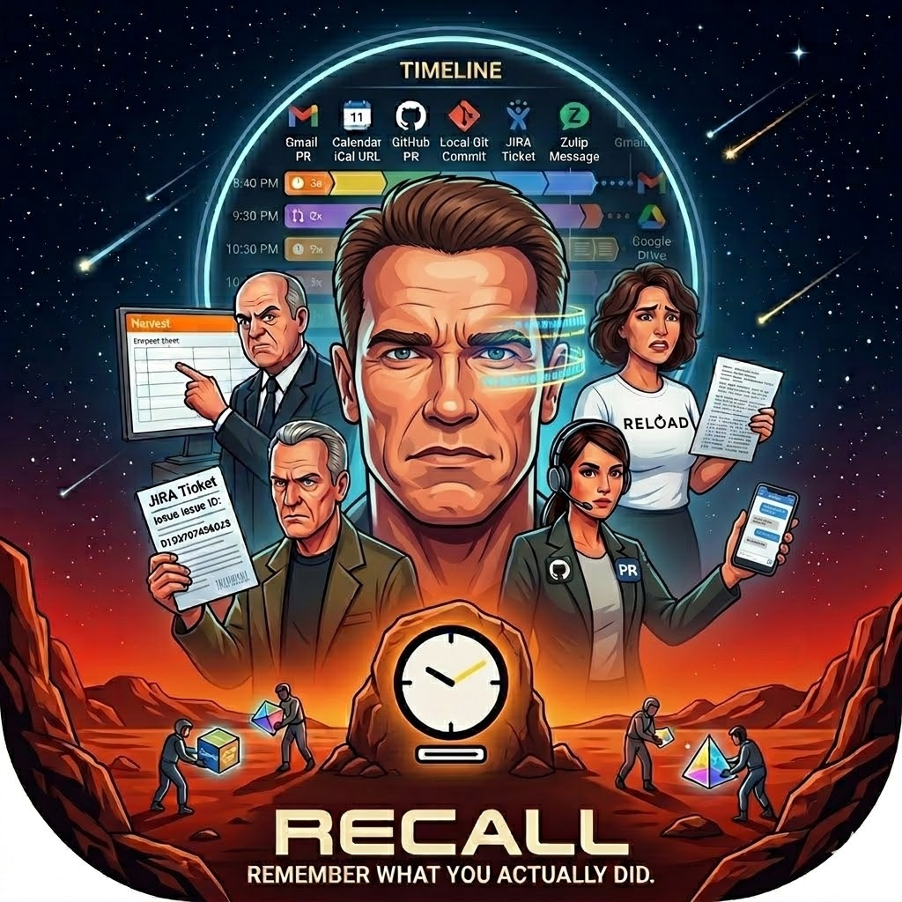
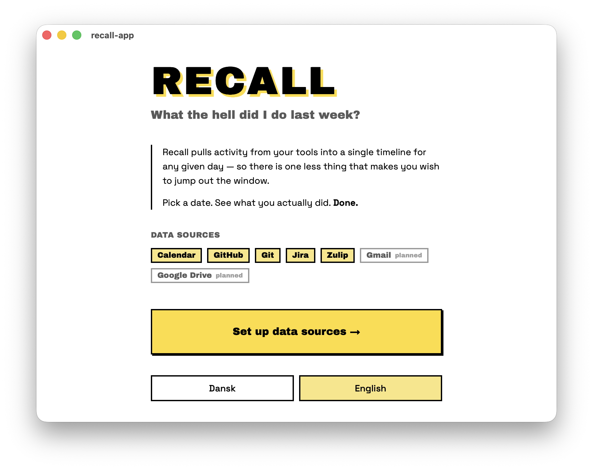
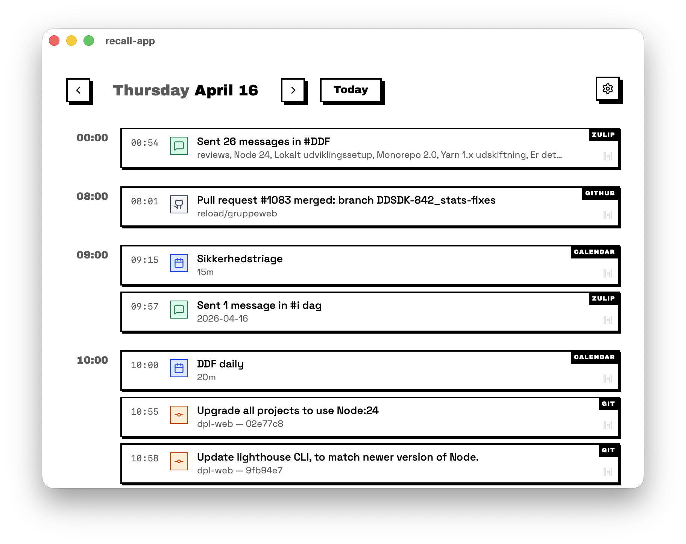
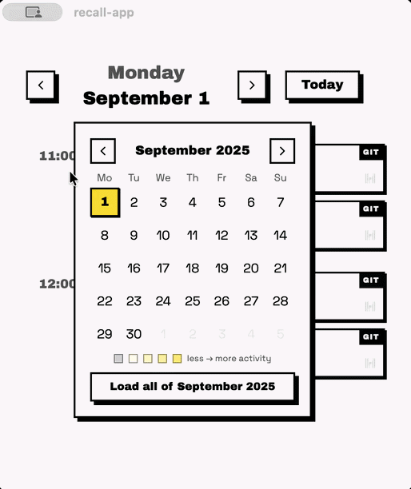

  <table width="100%">
    <tr>
      <td align="top" width="65%">
  <h1>Recall App</h1>
  A desktop app that builds a timeline of your prior workdays so you can fill in Harvest losing your mind.<br/><br/>
  Pick a date, and Recall pulls your activity from multiple sources into one view.<br/><br/>

  **Calendar**, **GitHub**, **Local git commits**, **JIRA**, **Zulip**, and more planned.
      </td>
      <td align="top" width="35%">
        
      </td>
    </tr>
  </table>
  
  <table>
    <tr>
      <td width="36%"></td>
      <td width="36%"></td>
      <td width="30%"></td>
    </tr>
  </table>

## Install

| Platform | Link |
|----------|------|
| macOS (Apple Silicon) | [Recall-macOS-AppleSilicon.dmg](https://github.com/rasben/recall-app/releases/latest/download/Recall-macOS-AppleSilicon.dmg) |
| macOS (Intel) | [Recall-macOS-Intel.dmg](https://github.com/rasben/recall-app/releases/latest/download/Recall-macOS-Intel.dmg) |
| Windows | [Recall-Windows.exe](https://github.com/rasben/recall-app/releases/latest/download/Recall-Windows.exe) · [Recall-Windows.msi](https://github.com/rasben/recall-app/releases/latest/download/Recall-Windows.msi) |
| Linux | [Recall-Linux.AppImage](https://github.com/rasben/recall-app/releases/latest/download/Recall-Linux.AppImage) · [Recall-Linux.deb](https://github.com/rasben/recall-app/releases/latest/download/Recall-Linux.deb) · [Recall-Linux.rpm](https://github.com/rasben/recall-app/releases/latest/download/Recall-Linux.rpm) |

## Development

This app has built almost entirely with AI.
First with `cursor`, then with `Claude Code`.

I have also experimented with AI-design for the logo.
[See the process here](https://rasben.github.io/recall-app/design/logo/preview/)

```
nvm use
npm install
npm run tauri dev
```

### Tech-Stack

- Svelte 5 + SvelteKit 2
- Tauri 2
- Rust backend
- SQLite for settings/credentials.

## Telemetry

Recall sends one anonymous ping per day to count active installs. The ping contains only a random UUID generated at first launch — no personal data, no device info, no IP addresses are stored. You can inspect the full implementation in [`src-tauri/src/telemetry.rs`](./src-tauri/src/telemetry.rs) and the server side in [`worker/src/index.js`](./worker/src/index.js).

## Security warning

> ⚠️ **Your API tokens are stored in plain text.** - just like every other app does..
>
> GitHub / Jira / Zulip tokens and iCal secret URLs are saved unencrypted in the SQLite file under the app-data directory (e.g. `~/Library/Application Support/com.recall-app.app/db.sqlite` on macOS). Anything running as your user — a malicious npm postinstall script, a rogue VS Code extension, a cloud-synced backup on a stolen laptop — can read them.
>
> If that matters to you, use tokens with the narrowest scope you can, and treat them as rotatable.

## To-Do's

See [TODO.md](./TODO.md) for the roadmap and ideas list.
